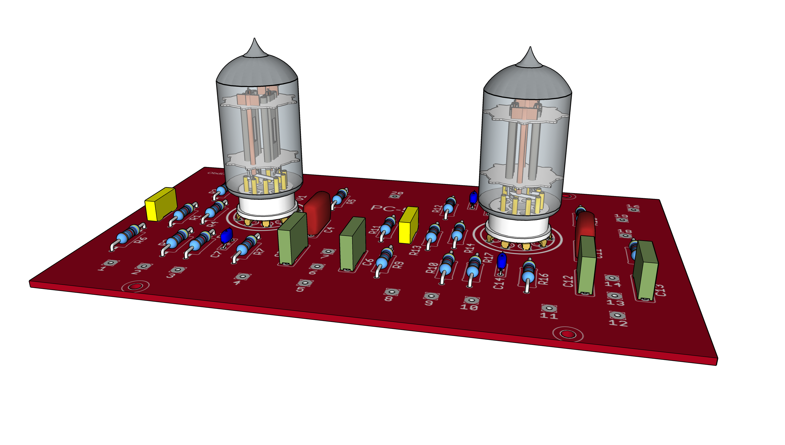

Dynakit PAS-3 PC-5 Line Stage circuit board
==========================================
The boards retain the original Dynakit PAS circuitry but uses available through hole capacitors. Original solder pad numbering is retained and silk-screened on circuit board. 

